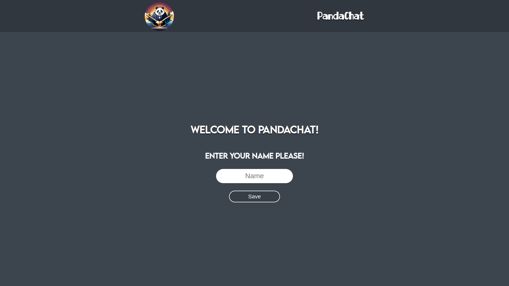
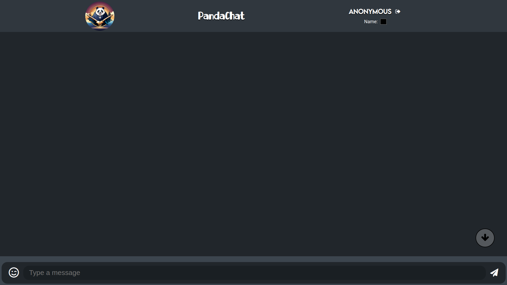
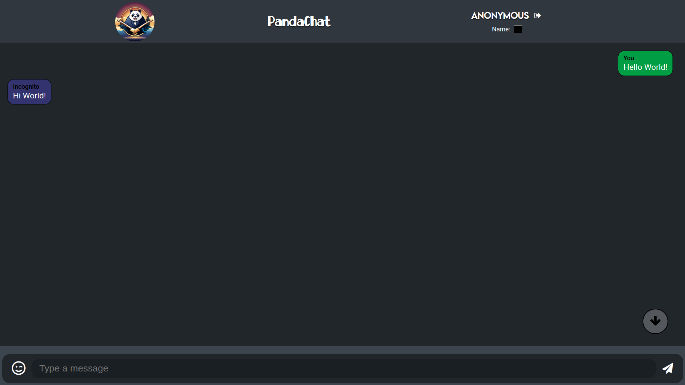

# <h2 style="text-align:center;">PandaChat - The Old Version</h2>

#### This version was made purely for fun with vanilla Javascript and WebSockets.

To run the website, clone this repo and [ChatApp-Backend-Old](https://github.com/AbdullahBRashid/ChatApp-Backend-Old).

Start the `Backend Server` using the Backend repo.

In ["js/app.js"](https://github.com/AbdullahBRashid/ChatApp-Old/blob/master/js/app.js), change the websocket address to the server address you run your backend on.

This is plain HTML, CSS and JavaScript. Just host this repo using any server.

##### For example:

### Using NPM live-server (Development Server only)

    # npm i -g live-server
    $ live-server --port:8080

The rest is on you. You can fork and work on it. Learn from it or anything. Best of luck.